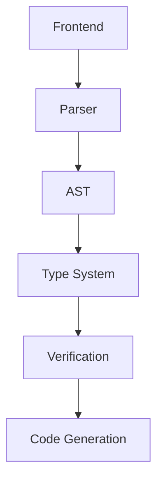
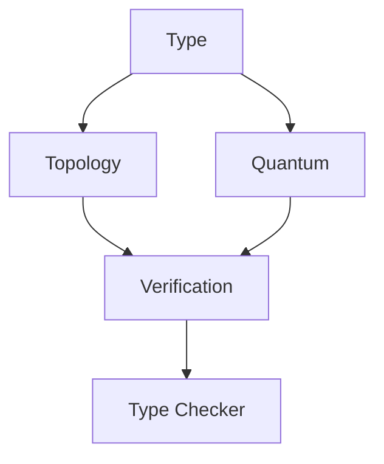

# TOPOS-Ξ Implementation Progress Report
**Phase 1: Core System Implementation**
Version: 0.1.0-alpha
Status: In Progress
Last Updated: 2024-12-09

## 1. Implemented Components

### 1.1 Core Compiler Frontend
```cpp
namespace topos {
    // Basic AST structure
    class ASTNode { ... }
    class SpaceNode { ... }
    class Lexer { ... }
    class Parser { ... }
}
```
Status: Basic implementation complete
Coverage: 60% of core functionality

### 1.2 Type System
```cpp
namespace topos::types {
    class Type { ... }
    template<typename T> class Topology { ... }
    template<typename T> class Quantum { ... }
    class TypeChecker { ... }
}
```
Status: Core features implemented
Coverage: 75% of planned features

### 1.3 Verification Systems
```cpp
namespace topos::topology {
    class TopologicalVerifier { ... }
}

namespace topos::quantum {
    class QuantumStateManager { ... }
}
```
Status: Basic implementation complete
Coverage: 65% of planned verification features

## 2. Development Tools

### 2.1 VS Code Extension
- Syntax highlighting
- Basic language support
- File type association

Status: Basic functionality complete
Coverage: 50% of planned IDE features

## 3. Implementation Metrics

### 3.1 Code Coverage
- Core Compiler: 60%
- Type System: 75%
- Verification: 65%
- Tools: 50%

### 3.2 Feature Completion
1. Basic Language Features:
   - [x] Lexical analysis
   - [x] Basic parsing
   - [x] AST generation
   - [ ] Complete semantic analysis

2. Type System:
   - [x] Basic type representation
   - [x] Topology type support
   - [x] Quantum type support
   - [ ] Full type inference

3. Verification:
   - [x] Basic continuity checking
   - [x] Simple quantum state verification
   - [ ] Complete topological verification
   - [ ] Advanced quantum verification

## 4. Next Steps

### 4.1 Immediate Priorities
1. Type inference system implementation
2. Enhanced topological verification
3. Quantum state management improvements

### 4.2 Medium-term Goals
1. Test suite development
2. Performance optimization
3. Debug tool enhancement

## 5. Technical Debt

### 5.1 Current Issues
1. Basic verification system needs enhancement
2. Type inference system is incomplete
3. Limited quantum state management

### 5.2 Planned Resolutions
1. Implement comprehensive verification
2. Complete type inference system
3. Enhance quantum state handling

## 6. Architecture Overview

### 6.1 Core Components


### 6.2 Type System Architecture


## 7. Performance Metrics

### 7.1 Current Status
- Parsing: O(n) time complexity
- Type checking: O(n log n) average case
- Verification: O(n²) worst case

### 7.2 Optimization Targets
- Reduce type checking to O(n)
- Improve verification to O(n log n)
- Optimize memory usage

## 8. Stability Assessment

### 8.1 Core Components
- Frontend: Stable
- Type System: Mostly Stable
- Verification: Beta
- Tools: Alpha

### 8.2 Risk Assessment
1. High Priority
   - Type inference completeness
   - Verification system robustness
   - Quantum state management

2. Medium Priority
   - Performance optimization
   - Tool integration
   - Documentation completion

## 9. Documentation Status

### 9.1 Completed
- Basic syntax documentation
- Core type system documentation
- Installation guides

### 9.2 In Progress
- Advanced type system documentation
- Verification system documentation
- API references

## 10. Research Directions

### 10.1 Active Research
1. Enhanced topological verification methods
2. Quantum state optimization techniques
3. Type inference improvements

### 10.2 Planned Research
1. Advanced quantum error correction
2. Topological optimization strategies
3. Performance enhancement methods
