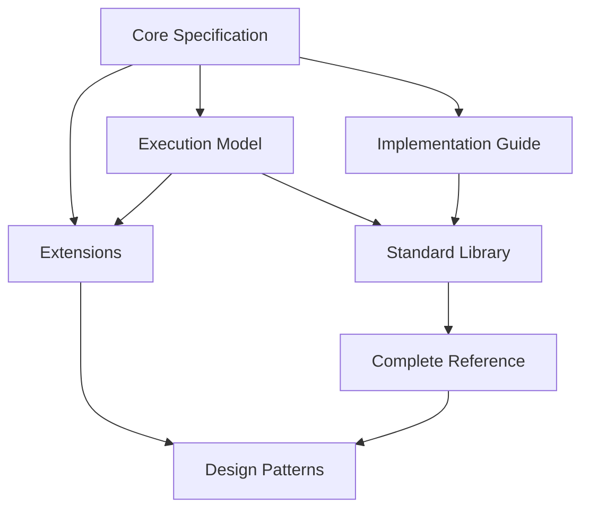

# TOPOS-Ξ Project Structure and Dependencies

## 1. Document Hierarchy

### 1.1 Core Specifications
- `core-spec.md`: Core language specification
- `execution-model.md`: Execution model specification
- `implementation-guide.md`: Implementation guidelines

### 1.2 Library and Reference
- `std-lib.md`: Standard library specification
- `complete-ref.md`: Complete reference specification
- `design-patterns/`: Design pattern collections
  - `structural-patterns.md`
  - `transformation-patterns.md`
  - `invariant-patterns.md`

### 1.3 Extensions
- `extensions/`: Language extensions
  - `observable-ext.md`: Observable extension
  - `quantum-ext.md`: Quantum extension
  - `core-ext.md`: Core extensions
  - `output-path.md`: Observable output paths

### 1.4 Meta Documentation
- `meta/`: Meta documentation
  - `review-guidelines.md`: Review guidelines
  - `default-properties.md`: Default property specification

## 2. Dependencies Graph



## 3. Version Control

### 3.1 Current Version State
- Core Specification: v2.0
- Extensions: v1.0-1.1
- Implementation Guide: v1.0
- Standard Library: v1.0

### 3.2 Compatibility Matrix
| Component | Requires | Compatible With |
|-----------|----------|-----------------|
| Core Extensions | Core v2.0+ | All Extensions v1.0+ |
| Quantum Extensions | Core v2.0+ | Observable v1.0+ |
| Observable Extensions | Core v2.0+ | Quantum v1.0+ |

## 4. Document Conventions

### 4.1 File Structure
Each specification document must follow this structure:
1. Title and Version
2. Basic Principles
3. Main Content
4. Implementation Requirements
5. Future Extensions

### 4.2 Code Examples
All code examples must be wrapped in ```topology blocks and include:
- Properties declaration
- Mapping definitions
- Path specifications

## 5. Retrieval Tags

### 5.1 Core Tags
- `#TOPOS-Core`
- `#TOPOS-Execution`
- `#TOPOS-Implementation`

### 5.2 Extension Tags
- `#TOPOS-Observable`
- `#TOPOS-Quantum`
- `#TOPOS-Extension`

### 5.3 Pattern Tags
- `#TOPOS-Pattern-Structural`
- `#TOPOS-Pattern-Transform`
- `#TOPOS-Pattern-Invariant`
